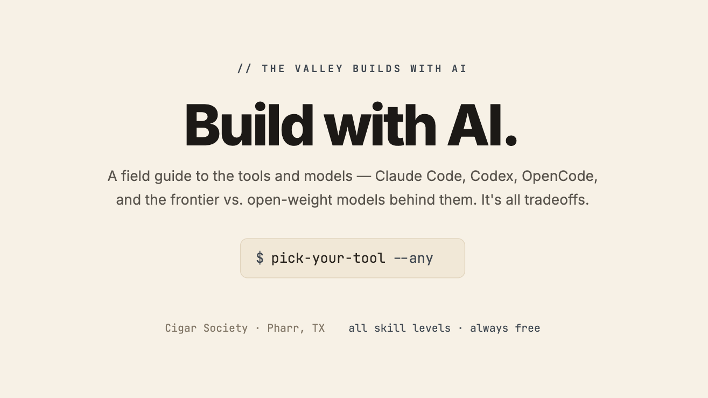

[](https://cigar-ai-workshops.github.io/smoke-code-day-1/)

# Build with AI

A field guide to AI coding tools and the models behind them — Claude Code, Codex, OpenCode, Gemini CLI, and more. Covers the landscape, tradeoffs, and practical workflow for picking the right tool.

**June 24, 2026 — Pharr, Texas**

## AI Subscriptions

| Link | Description | Platform |
|------|-------------|----------|
| [OpenCode · Go](https://opencode.ai/go) | Open-source coding agent — choose any model, terminal-first | Web, macOS, Win, Linux |
| [ChatGPT](https://chatgpt.com/) | OpenAI's flagship — GPT-5, reasoning, image gen, voice | Web, macOS, Win, iOS, Android |
| [Claude](https://claude.ai) | Anthropic's assistant — long context, coding, safety-first | Web, macOS, iOS, Android |
| [Gemini](https://gemini.google.com/app) | Google's multimodal — video, images, code, 1M context | Web, iOS, Android |
| [Grok](https://grok.com/) | xAI's model — real-time web, X integration, conversational | Web, iOS, Android |

## Apps (Model Agnostic)

| Link | Description | Platform |
|------|-------------|----------|
| [VS Code](https://code.visualstudio.com/) | Microsoft's free, open-source code editor — extensions, Git, terminal, AI via Copilot | macOS, Win, Linux, Web |
| [Claude Code](https://claude.ai/code) | Anthropic's agentic coding tool — terminal-first, long context, CLAUDE.md, skills | macOS, Win, Linux |
| [Codex CLI](https://codex.openai.com/) | OpenAI's terminal-native coding agent — sandboxed, model-agnostic execution | macOS, Win, Linux |
| [OpenCode](https://opencode.ai/) | Open-source coding agent — choose any model, terminal-first | macOS, Win, Linux |
| [pi](https://pi.dev/) | Extensible coding agent — extensions, MCP, subagents | macOS, Linux |

## Agent Orchestrator

| Link | Description | Platform |
|------|-------------|----------|
| [Supacode](https://supacode.sh/) | Run 50+ coding agents in parallel — worktree isolation, Git/GitHub native | macOS 26+ |

## Compare Models & Trends

| Link | Description | Platform |
|------|-------------|----------|
| [OpenRouter Rankings](https://openrouter.ai/rankings) | Live model leaderboard — pricing, speed, capability comparisons | Web |
| [HuggingFace](https://huggingface.co) | Open-source model hub — datasets, benchmarks, community models | Web |

## Vertical Integration

### Claude

| Vertical | Link |
|----------|------|
| Customer Support | [claude.com/solutions/customer-support](https://claude.com/solutions/customer-support) |
| Education | [claude.com/solutions/education](https://claude.com/solutions/education) |
| Financial Services | [claude.com/solutions/financial-services](https://claude.com/solutions/financial-services) |
| Government | [claude.com/solutions/government](https://claude.com/solutions/government) |
| Healthcare | [claude.com/solutions/healthcare](https://claude.com/solutions/healthcare) |
| Legal | [claude.com/blog/claude-for-the-legal-industry](https://claude.com/blog/claude-for-the-legal-industry) |
| Life Sciences | [claude.com/solutions/life-sciences](https://claude.com/solutions/life-sciences) |
| Nonprofits | [claude.com/solutions/nonprofits](https://claude.com/solutions/nonprofits) |
| Security | [claude.com/solutions/security](https://claude.com/solutions/security) |

### OpenAI

| Vertical | Link |
|----------|------|
| Financial Services | [openai.com/solutions/industries/financial-services](https://openai.com/solutions/industries/financial-services) |
| Government | [openai.com/solutions/industries/government](https://openai.com/solutions/industries/government) |
| Healthcare | [openai.com/solutions/industries/healthcare](https://openai.com/solutions/healthcare) |
| All Industries | [openai.com/solutions](https://openai.com/solutions) |

## Quick Start

```
npm install
npm run dev
```

Open the dev server and present each link live.

---

## References & Inspiration

### GitHub Constellation India 2026 — Keynote

> **Source:** [https://www.youtube.com/watch?v=QNbJoEx36jA](https://www.youtube.com/watch?v=QNbJoEx36jA)
> **Speakers:** Jay Parikh (Microsoft EVP), Kyle Daigle (GitHub COO)
> **Event:** GitHub Constellation India, Bengaluru — April 11, 2026

### Andrej Karpathy: From Vibe Coding to Agentic Engineering

> **Source:** [https://www.youtube.com/watch?v=96jN2OCOfLs](https://www.youtube.com/watch?v=96jN2OCOfLs)
> **Speakers:** Andrej Karpathy (OpenAI co-founder, ex-Tesla AI) with Stephanie Zhan (Sequoia Capital)
> **Event:** Sequoia AI Ascent 2026
> **Published:** April 29, 2026
> **Duration:** 29 min

### Inside the Mind of Anthropic CEO Dario Amodei — Bloomberg

> **Source:** [https://www.youtube.com/watch?v=x2VHFgyawPE](https://www.youtube.com/watch?v=x2VHFgyawPE)
> **Speaker:** Dario Amodei (Anthropic CEO)
> **Channel:** Bloomberg Originals — The Circuit
> **Published:** June 17, 2026
> **Duration:** 1 hr 10 min

### What If AI Doesn't Ruin Everything? — Gavin Newsom & Reid Hoffman

> **Source:** [https://www.youtube.com/watch?v=gElLtoTMTI8](https://www.youtube.com/watch?v=gElLtoTMTI8)
> **Host:** Gavin Newsom
> **Guest:** Reid Hoffman (LinkedIn co-founder)
> **Published:** June 18, 2026
> **Duration:** 1 hr 50 min

### Mark Cuban: AI Hype vs. Reality — Big Technology Podcast

> **Source:** [https://www.youtube.com/watch?v=CEz9RRg0FfI](https://www.youtube.com/watch?v=CEz9RRg0FfI)
> **Host:** Alex Kantrowitz
> **Guest:** Mark Cuban
> **Published:** April 29, 2026
> **Duration:** 52 min

### Hermes AI Agent — NetworkChuck

> **Source:** [https://www.youtube.com/watch?v=QQEgIo4Juxg](https://www.youtube.com/watch?v=QQEgIo4Juxg)
> **Channel:** NetworkChuck
> **Topic:** Hermes open-source AI agent from Nous Research
> **Published:** May 20, 2026
> **Duration:** 32 min

### Full Walkthrough: Workflow for AI Coding — Matt Pocock

> **Source:** [https://www.youtube.com/watch?v=-QFHIoCo-Ko](https://www.youtube.com/watch?v=-QFHIoCo-Ko)
> **Channel:** AI Engineer
> **Published:** April 24, 2026
> **Duration:** 1 hr 36 min

### Claude Code — Frontend Masters

> **Source:** [https://frontendmasters.com/courses/claude-code/](https://frontendmasters.com/courses/claude-code/)
> **Instructor:** Lydia Hallie
> **Duration:** 1 hour, 56 minutes
>
> Learn Claude Code for free! Customize Claude Code for your codebase using CLAUDE.md, plan mode, and permissions that adhere to your team's standards. Build reusable skills tailored to your processes and wire up hooks so Claude behaves consistently across the whole team. Go under the hood with Claude Code to generate and ship higher-quality code.
>
> No credit card required. Prerequisite: knowledge of prompt engineering and basic software development experience.

### Billions Spent, Hypothetical Returns — The Guardian

> **Source:** [https://www.theguardian.com/technology/2026/jun/07/billions-spent-hypothetical-returns-the-ai-boom-explained-with-six-charts](https://www.theguardian.com/technology/2026/jun/07/billions-spent-hypothetical-returns-the-ai-boom-explained-with-six-charts)
> **Publication:** The Guardian
> **Published:** June 7, 2026
>
> Six charts explaining the AI boom — billions in investment vs. hypothetical returns.

### AI Investment Boom — Reuters Graphics

> **Source:** [https://www.reuters.com/graphics/USA-ECONOMY/AI-INVESTMENT/gkvlqbgxkpb/](https://www.reuters.com/graphics/USA-ECONOMY/AI-INVESTMENT/gkvlqbgxkpb/)
> **Publication:** Reuters
> **Type:** Interactive Graphics
>
> Visual deep-dive into AI investment trends across the US economy.

## Internships & Opportunities

### Anthropic — Claude Corps

> **Source:** [https://www.anthropic.com/claude-corps](https://www.anthropic.com/claude-corps)
> **Funding:** \$150M
> **Partners:** Anthropic, CodePath, Social Finance
> **Deadline:** July 17, 2026 (rolling; first cohort begins October 19, 2026)
>
> National fellowship program embedding 1,000 early-career, AI-trained fellows inside nonprofits across the US — fully funded, full-time, 12 months. Salary, benefits, API credits, grants, and Anthropic support all covered.
>
> **What you'll get:** \$85,000 salary + benefits, relocation support (>100 mi), Anthropic onboarding bootcamp, dedicated support with cohort sessions and office hours, and a portfolio reference.
